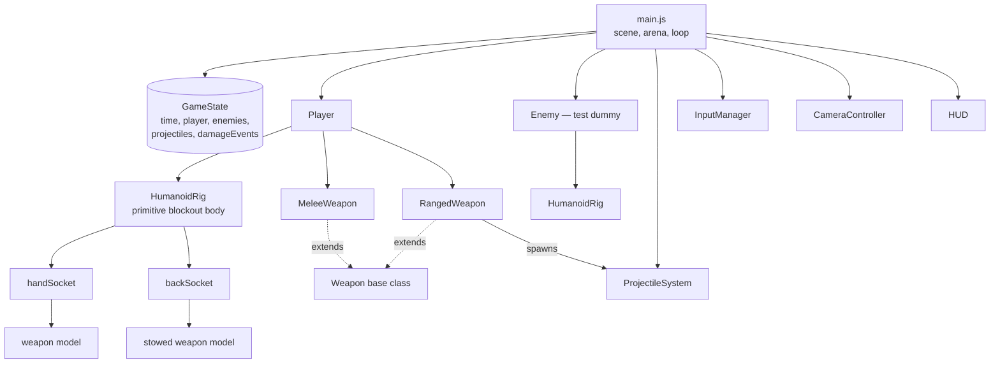
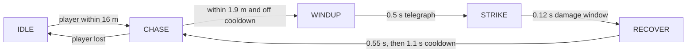

# Action RPG — Skeleton

A Minecraft Dungeons-flavoured action RPG, built skeleton-first. A humanoid blockout
character moves, aims, swings a sword and draws a ballistic bow, in **top-down or first
person**, against waves of **zombies** that close in and **skeleton archers** that keep
their distance.

Still deliberately unbuilt: upgrades, abilities, armour stats, and the rest of the weapon
roster.

Three.js + vanilla JS modules. No build step, no bundler, no network at runtime
(Three.js is vendored in `vendor/`).

## Run it

```bash
npm start            # serves the folder on http://localhost:8080
```

Then open <http://localhost:8080>. Any static server works; `npm start` is just a
15-line zero-dependency one.

```bash
npm install          # only needed for the test (installs Playwright)
npm run verify       # headless acceptance test, writes screenshot.png
```

## Controls

| Input | Action |
| --- | --- |
| `W` `A` `S` `D` | Move |
| `Shift` | Sprint (drains stamina) |
| Mouse | Aim — the hero turns to face the cursor |
| Left click | Swing the melee weapon |
| Hold right click | Draw the bow — release to loose |
| `1` / `2` | Choose which weapon is held (the other goes on the back) |
| `Q` | Mend — heal yourself |
| `I` | Inventory (pauses) |
| `V` | Toggle first person / top-down |
| `M` | Mute |
| `H` / `Q` | Debug: hurt yourself / reset the scene |

In first person the mouse is captured (click once to lock it, `Esc` to release), `W` walks
where you look, and the bow fires along your look pitch — so you aim *over* distance
rather than straight at it.

Gamepad: left stick moves, right stick aims, RT swings, RB fires, B reloads.

## What a frame does

One `GameState` object is the whole world. Systems mutate it in a fixed order; the
renderer and HUD only ever read from it.


Delta time is clamped to 50 ms, so a stalled tab resumes in slow motion instead of
teleporting everything through walls.

## Who owns what



## The rig

Everything hangs off one root node the movement code owns. Each joint is a `Group`
positioned *at* the joint, with its mesh translated down — so rotating the group swings
the limb from the shoulder/hip, not around its own middle.

```
                    ○  head (sphere)
                  ╭───╮
   shoulderL ●────┤   ├────● shoulderR ──► handSocket  (weapon in hand)
             │    │   │    │
          arm│    │   │    │arm            backSocket  (stowed weapon)
             │    ╰─┬─╯    │
                 ╱     ╲
             hipL       hipR
              │           │
            leg           leg
              ▼           ▼
        ──────────────────────  y = 0, root position
```

Animation states are procedural poses, layered in this order:

```
locomotion (idle / walk)  →  attack overrides the arms  →  hit recoil (additive)  →  death overrides all
```

Swapping in a rigged GLTF model later means rewriting `HumanoidRig.js` and nothing else:
gameplay code never touches a limb.

Arms have real joints: shoulder → upper arm (0.37 m) → elbow → forearm (0.33 m) → hand.
The bow poses place both hands by **two-bone IK** rather than hand-solved angles:

```
              elbow
               ●
        l1   ╱   ╲  l2
           ╱       ╲
  shoulder ●─── d ───● hand target
```

The law of cosines gives both angles from the triangle — the elbow's interior angle from
`(l1, l2, d)`, and how far the upper arm lifts off the straight line to the target. A
**pole vector** decides which way the elbow points (down and out for the bow arm, up and
back for the draw arm), since the triangle alone leaves the arm free to spin around the
shoulder-to-target axis.

One trap worth recording: the IK frame's X axis *is* the elbow's bend axis, so rolling the
shoulder frame to orient the held bow flips that axis and breaks the chain — the hand then
misses its target by 22 cm. The roll belongs on the hand, not the arm.

**Socket orientation rule:** the hand socket sits at the *end* of the arm, and the arm's
local −Y runs down the limb away from the shoulder. A weapon must therefore be modelled
extending along −Y. Building it along +Y sends the blade back up through the character's
own forearm — which is exactly what the first version did.

The sword swing is a **horizontal slash**, matching the shape of the damage cone: the arm
lifts to shoulder height (`rotation.x`), then sweeps through ±50° (`rotation.y`) while the
body twists with it. The shoulder joints use Euler order `YXZ` so the sweep happens about
the body's vertical axis no matter how far the arm is already raised — under the default
`XYZ` order a "horizontal" slash tips over as the arm lifts.

## Combat shapes

Melee is an arc test, run only during the ACTIVE window of the swing, with each target
hit at most once per swing:

```
            ╲   arc = 100°   ╱
             ╲             ╱          hit if:
              ╲           ╱             distance ≤ range + targetRadius
               ╲    ▲    ╱              AND |angle from facing| ≤ arc / 2
                ╲  ／╲  ╱
                 ╲╱   ╲╱
                  ●  hero (facing ▲)
    |--- windup ---|--- active ---|--- recovery ---|
    0             0.35          0.60              1    (swing progress)
```

Arrows are **ballistic**. The launch angle is solved from the projectile-motion equation
so the shot carries to the weapon's own `range`:

```
    sin(2 · pitch) = gravity · range / speed²
```

...then capped so the arc never rises more than 0.5 m above the muzzle. Without that cap
the physically-correct solution lobs the arrow ~0.9 m up and it sails clean over a 2 m
target standing at half range — correct, and horrible to play. With it, the whole flight
stays inside a human silhouette while the drop is still clearly visible:

```
   y (m)
   2.0 ┤
   1.7 ┤      ●━━━●━━━●                      launch pitch 6.3°
   1.4 ┤   ●            ●━━━●
   1.1 ┤ ●                     ●             ← 1.0 m at 20 m (the bow's range)
   0.8 ┤●                          ●
   0.5 ┤                              ●
   0.2 ┤                                 ●▼  sticks in the ground at ~26 m
       └┬────┬────┬────┬────┬────┬────┬───
        0    5    10   15   20   25  metres
```

Collision is a **swept** test, because a 30 m/s arrow moves further in one frame than a
dummy is wide and would otherwise tunnel straight through — plus a height check at the
point of closest approach, so an arrow that has already dropped to ankle height sails
under everything and lands:

```
    prev ●───────────────────● next        ○ target (radius r, height 2 m)
          ╲_____ closest distance to the segment _____╱   hit if ≤ r + arrowRadius
                                                          AND 0.15 m ≤ y ≤ 2 m
```

## The bow is draw-and-hold

Tapping the button fires; holding it draws. Draw strength scales two things at once, so a
full pull is worth waiting for and a panic shot is genuinely bad:

```
  draw     damage        arrow speed     arc
  ────────────────────────────────────────────────────────
  0%        6.3          20 m/s          loopy, short
  50%      14.7          29 m/s          moderate
  100%     23.1          39 m/s          flat and fast
```

The arrow's launch angle is solved from its *actual* speed, so a weak shot lobs and a full
draw shoots flat without any separate trajectory code. The draw meter on the HUD shows the
damage the shot would do right now, and the crosshair tightens as the string comes back.
Swinging the sword abandons a half-drawn arrow.

The string is real: two segments running from each limb tip to a shared nocking point that
sits **exactly** on the draw hand, with a brown-and-white arrow nocked on it.

The bow rides in the **off hand** and is drawn with the main hand, the way an archer
actually holds one. Holding it in the main hand meant the draw hand had to reach across
the chest to find the string — anatomically impossible, and it looked it.

Proportion is what sells it. A real bow is drawn about 0.4 of its own height. The first
version was 0.84 m tall with a 0.77 m draw — a ratio of 0.9 — so the string came back
further than the bow was tall and the draw hand ended up outside the bow's frame, which
reads as gripping the limb rather than the string. It is now **1.24 m tall with a 0.55 m
draw** (0.44), and both numbers are asserted so they cannot drift back.

```
        tip ●
             ╲
              ●── nock, sitting on the draw hand (5.8 cm, measured in the test suite)
             ╱
        tip ●
```

Landing the hand there is solved, not eyeballed. With shoulders on Euler order `YXZ` and
the arm hanging down its local −Y, setting `rotation.x ≈ π/2` lays the arm horizontal and
`rotation.z` swings it across the body, putting the hand at
`shoulder + 0.7 · (sin z, ~0, −cos z)`. The bow grip sits at about `(0.33, 1.42, −0.69)`
in body space and the nocking point half a metre behind it — from the left shoulder those
are `z = 0.75` and `z = 1.32`, both exactly one arm length away, so the hand reaches the
bow at rest and the anchor at full draw.

## Arrows are a resource, not a magazine

There is no reload. The quiver on your back holds **12 arrows**, it visibly empties as you
shoot, and the only way to refill it is to walk over an **arrow bundle** on the ground. A
few are kept on the field at all times, never within 5 m of you, so running dry is a reason
to move rather than a dead end. A full quiver leaves a bundle where it is.

See [BACKLOG.md](BACKLOG.md) for where this is going — enemy drops, recovering spent
arrows (they already stick in the ground), bundle sizes.

## Mend, and the ability slots

`Q` heals you for 32 on a **7 second cooldown**, costing 25 stamina. The short
cooldown is the point: it is part of the rhythm of a fight, not an emergency button
you hoard. What keeps it honest is that healing and sprinting draw on the same stamina
pool, so escaping and recovering compete. It refuses to fire at full health, so a
mistimed press does not eat the cooldown for nothing.

It lives in `Player.abilities[0]`, built on an `Ability` base class that owns the
cooldown and cost bookkeeping — subclasses override `apply()`, so neither can be
forgotten. Slots 2 and 3 (`E`, `R`) are still empty. Cooldowns are per ability, never
shared, so all three can be planned around independently.

## Zombies

Waves spawn on a ring around you and close in. Each zombie runs one small state machine
driven only by distance:



The important part is that **WINDUP is long and visible** — both arms rear up overhead —
while **STRIKE is a single instant** that only lands if you are still inside the cone at
that moment. Backing off during the telegraph genuinely saves you, which is what makes
the fight readable instead of a coin flip.

Zombies spawn at one of four **ranks**, rolled per spawn and leaning heavier the
longer the run goes:

| Rank | Kit | Health | Damage | Reach | Defense |
| --- | --- | --- | --- | --- | --- |
| Risen | bare hands | 60 | 9 | 1.9 m | 0 |
| Mailed | helmet + chest plate | 85 | 11 | 1.9 m | 3 |
| Armed | sword | 70 | 15 | 2.5 m | 0 |
| Revenant | both | 110 | 18 | 2.5 m | 4 |

An armed zombie swings the sword animation instead of clawing, and outranges you if
you misjudge the gap. Armour is flat damage reduction, but never reduces a hit to
nothing — a chip always lands, so armoured enemies are slower to kill, never immune.

Crucially, a zombie **keeps walking and turning through its windup** (at 62% speed) rather
than rooting in place. A zombie that freezes the moment it raises its arms is trivially
strolled away from, and its strike lands where you *were*. Moving through the telegraph
means you have to actually break the cone, not just keep walking. Zombies also shove each
other apart, so a pack surrounds you instead of stacking into one spot.

## Skeleton archers

Where a zombie closes, a skeleton wants distance. It holds a band and only shoots from
inside it, circling while its shot is on cooldown:

```
  ◀── back away ──│◀──── shoots from in here ────▶│── walk closer ──▶
  0              4.5 m                          13 m           aggro 22 m
```

The 0.9 s draw is the whole tell — the string visibly pulls back — and its arrows are slow
(18 m/s) so a moving target can sidestep one. Push one out of its band and it abandons the
shot rather than firing point blank. Arrows carry a `team`, so skeleton fire hits you and
never the zombies beside you.

Getting hit staggers a character: the torso snaps back and the arms fly out on a sine
curve, so the reaction reads even mid-attack.

## Movement has a front

Speed depends on where you are going relative to where you face, so backing away from a
zombie is a real retreat rather than a second forward gear:

```
        forward 1.00
             ▲
   0.78 ◀────●────▶ 0.78      (strafe)
             ▼
        backward 0.55
```

## Sound

Every cue is synthesised at runtime from oscillators and filtered noise — no audio files,
because the project has no asset pipeline and a blockout does not need recorded foley. It
also means the sound follows the gameplay values: a fully drawn bow twangs lower and
louder than a snap shot, and a heavy hit thuds deeper than a scratch.

Entities never touch the audio system. They push events onto `GameState.events`, and
`AudioManager` drains that queue each frame — the same pattern the HUD uses for damage
numbers. Browsers refuse to start audio before a gesture, so the context opens on your
first click or key press. `M` mutes.

## Inventory

`I` pauses and shows what you are carrying with the numbers behind it: melee damage,
attacks/sec, DPS, range and arc; bow damage range, draw time, rate, range, arrow speed
and arrows left; the empty armour slot; your three ability slots with their cooldowns;
and your own health, stamina, move speed and defense. Read-only for now — there is
nothing to swap to yet.

## Conventions worth knowing

- **Yaw**: `rotation.y = yaw` points an object's local −Z along `(-sin yaw, -cos yaw)`.
  Use `yawFromDirection(dx, dz)` / `directionFromYaw(yaw)`; never hand-roll the `atan2`.
- **Weapon `speed`** is uses-per-second for *both* types (attacks/sec, shots/sec).
  Ranged keeps arrow velocity separately in `projectileSpeed`, so an upgrade can make you
  shoot faster without making arrows fly faster.
- **Aim** comes from a ray onto the ground plane. A cursor sitting on top of the hero
  (within 0.9 m) counts as *no* aim, and the hero faces their movement direction instead.
- The camera is **locked**: fixed offset `(0, 11.5, 9)`, ~52° down, no rotation, no zoom.
  It eases toward the hero and leans up to 1.5 m toward the cursor.

## Layout

```
index.html                  canvas + HUD markup + import map
vendor/three.module.js      Three.js r169, vendored (runs offline)
src/
  main.js                   scene, arena, lights, the frame loop
  GameState.js              the single per-frame state object
  mathUtils.js              yaw/damping/segment helpers
  entities/
    Player.js               health, stamina, equipment, movement, attacks
    Enemy.js                base enemy / the test dummy: health, hit reaction, death
    Zombie.js               chase + telegraphed melee attack state machine
    Skeleton.js             kiting archer: holds a range band, draws, looses
    ArrowBundle.js          ground pickup that refills the quiver
    HumanoidRig.js          primitive humanoid + hand/back sockets + poses
    weaponModels.js         blockout sword and bow props
  combat/
    Weapon.js               base class: name, type, damage, speed, range, cooldown
    MeleeWeapon.js          swing state machine + arc hit detection
    RangedWeapon.js         ammo, reload, projectile spawning
    ProjectileSystem.js     ballistic arrows, gravity, swept collision, ground stick
                            (arrow art is shared with the bow's nocked arrow)
    weapons.config.js       stat table (Phase 1: sword + bow only)
  abilities/
    Ability.js              base class: cooldown, cost, trigger bookkeeping
    Mend.js                 the heal (Q)
  systems/
    InputManager.js         keyboard/mouse/gamepad → moveVector + aimYaw
    CameraController.js     locked top-down follow camera + first person
    AudioManager.js         runtime-synthesised sound, no asset files
  ui/
    HUD.js                  bars, ammo, draw meter, damage numbers, enemy health bars
tools/
  serve.mjs                 zero-dependency static server
  verify.mjs                headless Phase 1 acceptance test
```

## Acceptance — passing

`npm run verify` drives the real game in headless Chromium with real key presses and
mouse clicks, and waits on game state rather than wall-clock sleeps (headless software
rendering runs at ~10 fps, so fixed sleeps mean nothing).

**56/56 checks passing**, covering: boot and render; WASD movement; mouse aim; melee swing
and damage numbers; bow draw, release, travel, arc height, ground stick and hit; reload;
player hit reaction; zombie chase, telegraph, strike, mid-windup movement and death;
skeleton draw, loose, damage and range keeping; team-correct arrows; charge scaling for
both damage and arrow speed; enemy health bars; directional speed; first-person camera,
mouse-look and movement basis; audio cue plumbing; and zero console errors.

```
$ npm run verify
...
PASS  a full draw hits harder than a snap shot  (6.3 -> 23.1 damage)
PASS  a full draw flies faster and flatter  (20 -> 39 m/s)
PASS  a charged arrow actually lands harder  (tap 6 vs full draw 23)
PASS  skeleton keeps its distance instead of closing  (held 9.0 m, min range 4.5)
PASS  enemy arrows do not hit other enemies  (dummy 200/200)
PASS  zombies keep closing in during their windup  (moved 0.21 m mid-windup at x0.62 speed)
PASS  forward is faster than strafing, strafing faster than backpedalling  (1.00 / 0.78 / 0.55)
PASS  the draw hand grips the actual bowstring  (hand to nocking point: 0.0 cm)
PASS  the draw is in proportion to the bow  (0.55 m draw on a 1.24 m bow (0.44))
PASS  arrows on the back match the arrows you have  (12 shown at full, 4 shown at 4)
PASS  walking over a bundle refills the quiver  (2 -> 7 arrows)
PASS  IK puts both hands on their targets  (bow hand off by 0.9 cm, draw hand 2.0 cm)
PASS  the draw arm bends and the bow arm stays long  (draw elbow 78°, bow elbow 19°)
PASS  armoured zombies wear armour and soak damage  (took 17 vs 20, defense 3)
PASS  Q heals you  (40 -> 72 health)
PASS  the heal goes on cooldown  (7s cooldown, 7.0s left)

56/56 checks passed
```

## Deliberately not built yet

Known issues and the full deferred list live in **[BACKLOG.md](BACKLOG.md)** — including
the arms and bow animation, which need real elbows before they will look right.

Each of these has a plug point already in place, and nothing else has to change shape:

| Milestone | Plug point that already exists |
| --- | --- |
| 2. Full weapon roster (scythe, daggers, shortbow, crossbow) | `weapons.config.js` — add stat entries; the classes already carry every field, including `chargeTime: 0` for a crossbow's instant trigger |
| 3. Armour + upgrades | `Player.equippedArmor` and the `defense` / `staminaRegen` / `moveSpeedModifier` getters read through it; `Weapon.level` + the `damage`/`speed` getters are where the curve goes |
| 4. Three abilities | `Player.abilities[3]` — three independent empty slots |
| 5. HUD polish (cooldown sweeps, hit-stop, screen shake) | `HUD.js`, and `CameraController` owns the camera transform |
| 6. More enemy types + a real dungeon room | `Zombie.js` is the template: subclass `Enemy`, add a state machine. The arena in `main.js` is still one flat box |
