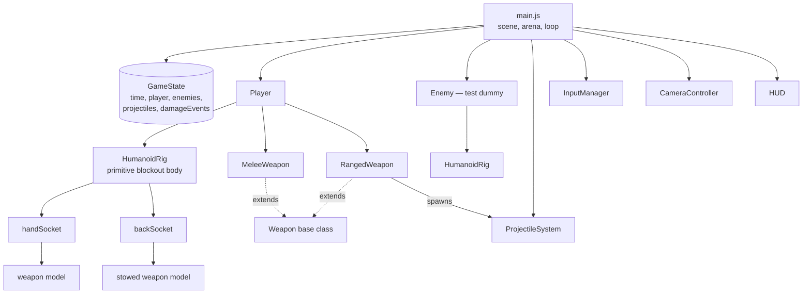

# Action RPG — Phase 1 Skeleton

A Minecraft Dungeons-flavoured action RPG, built skeleton-first. **This is Phase 1 only:**
a humanoid blockout character that moves, aims, swings one melee weapon and fires one
ranged weapon at a test dummy. No upgrades, no abilities, no armour stats, no enemy AI —
those are deliberately not built yet.

Three.js + vanilla JS modules. No build step, no bundler, no network at runtime
(Three.js is vendored in `vendor/`).

## Run it

```bash
npm start            # serves the folder on http://localhost:8080
```

Then open <http://localhost:8080>. Any static server works; `npm start` is just a
15-line zero-dependency one.

```bash
npm install          # only needed for the test (installs Playwright)
npm run verify       # headless acceptance test, writes screenshot.png
```

## Controls

| Input | Action |
| --- | --- |
| `W` `A` `S` `D` | Move |
| `Shift` | Sprint (drains stamina) |
| Mouse | Aim — the hero turns to face the cursor |
| Left click | Swing the melee weapon |
| Right click | Fire the ranged weapon |
| `R` | Reload |
| `1` / `2` | Choose which weapon is held (the other goes on the back) |
| `H` / `Q` | Debug: hurt yourself / reset the scene |

Gamepad: left stick moves, right stick aims, RT swings, RB fires, B reloads.

## What a frame does

One `GameState` object is the whole world. Systems mutate it in a fixed order; the
renderer and HUD only ever read from it.

```mermaid
flowchart LR
    RAF([requestAnimationFrame]) --> IN[InputManager.update<br/>keys + mouse ray → moveVector, aimYaw]
    IN --> ACT[handleActions<br/>click → swing / fire / reload]
    ACT --> PL[Player.update<br/>aim, move, collide, stamina]
    PL --> WP[Weapon.update<br/>swing arc hits / reload timer]
    WP --> EN[Enemy.update<br/>hit reaction, death, respawn]
    EN --> PR[ProjectileSystem.update<br/>swept hit test]
    PR --> CAM[CameraController.update]
    CAM --> HUD[HUD.update<br/>bars, ammo, damage numbers]
    HUD --> R[[renderer.render]]
    R --> RAF
```



Delta time is clamped to 50 ms, so a stalled tab resumes in slow motion instead of
teleporting everything through walls.

## Who owns what



## The rig

Everything hangs off one root node the movement code owns. Each joint is a `Group`
positioned *at* the joint, with its mesh translated down — so rotating the group swings
the limb from the shoulder/hip, not around its own middle.

```
                    ○  head (sphere)
                  ╭───╮
   shoulderL ●────┤   ├────● shoulderR ──► handSocket  (weapon in hand)
             │    │   │    │
          arm│    │   │    │arm            backSocket  (stowed weapon)
             │    ╰─┬─╯    │
                 ╱     ╲
             hipL       hipR
              │           │
            leg           leg
              ▼           ▼
        ──────────────────────  y = 0, root position
```

Animation states are procedural poses, layered in this order:

```
locomotion (idle / walk)  →  attack overrides the arms  →  hit recoil (additive)  →  death overrides all
```

Swapping in a rigged GLTF model later means rewriting `HumanoidRig.js` and nothing else:
gameplay code never touches a limb.

## Combat shapes

Melee is an arc test, run only during the ACTIVE window of the swing, with each target
hit at most once per swing:

```
            ╲   arc = 100°   ╱
             ╲             ╱          hit if:
              ╲           ╱             distance ≤ range + targetRadius
               ╲    ▲    ╱              AND |angle from facing| ≤ arc / 2
                ╲  ／╲  ╱
                 ╲╱   ╲╱
                  ●  hero (facing ▲)
    |--- windup ---|--- active ---|--- recovery ---|
    0             0.35          0.60              1    (swing progress)
```

Projectiles use a **swept** test, because a 30 m/s arrow moves further in one frame than
a dummy is wide and would otherwise tunnel straight through:

```
    prev ●───────────────────● next        ○ target (radius r)
          ╲_____ closest distance to the segment _____╱      hit if ≤ r + arrowRadius
```

## Conventions worth knowing

- **Yaw**: `rotation.y = yaw` points an object's local −Z along `(-sin yaw, -cos yaw)`.
  Use `yawFromDirection(dx, dz)` / `directionFromYaw(yaw)`; never hand-roll the `atan2`.
- **Weapon `speed`** is uses-per-second for *both* types (attacks/sec, shots/sec).
  Ranged keeps arrow velocity separately in `projectileSpeed`, so an upgrade can make you
  shoot faster without making arrows fly faster.
- **Aim** comes from a ray onto the ground plane. A cursor sitting on top of the hero
  (within 0.9 m) counts as *no* aim, and the hero faces their movement direction instead.
- The camera is **locked**: fixed offset `(0, 11.5, 9)`, ~52° down, no rotation, no zoom.
  It eases toward the hero and leans up to 1.5 m toward the cursor.

## Layout

```
index.html                  canvas + HUD markup + import map
vendor/three.module.js      Three.js r169, vendored (runs offline)
src/
  main.js                   scene, arena, lights, the frame loop
  GameState.js              the single per-frame state object
  mathUtils.js              yaw/damping/segment helpers
  entities/
    Player.js               health, stamina, equipment, movement, attacks
    Enemy.js                the test dummy: health, hit reaction, death, respawn
    HumanoidRig.js          primitive humanoid + hand/back sockets + poses
    weaponModels.js         blockout sword and bow props
  combat/
    Weapon.js               base class: name, type, damage, speed, range, cooldown
    MeleeWeapon.js          swing state machine + arc hit detection
    RangedWeapon.js         ammo, reload, projectile spawning
    ProjectileSystem.js     arrow movement + swept collision
    weapons.config.js       stat table (Phase 1: sword + bow only)
  systems/
    InputManager.js         keyboard/mouse/gamepad → moveVector + aimYaw
    CameraController.js     locked follow camera
  ui/
    HUD.js                  bars, ammo, weapon chips, floating damage numbers
tools/
  serve.mjs                 zero-dependency static server
  verify.mjs                headless Phase 1 acceptance test
```

## Phase 1 acceptance — passing

`npm run verify` drives the real game in headless Chromium with real key presses and
mouse clicks:

```
PASS  game boots and renders frames
PASS  WASD moves the character
PASS  mouse aim turns the hero toward the cursor
PASS  left click starts a swing
PASS  melee swing damages the dummy
PASS  damage numbers appear
PASS  right click fires and spends ammo
PASS  projectile travels
PASS  projectile hits the dummy
PASS  player takes damage and plays a hit reaction
PASS  reload starts when the magazine is empty
PASS  reload refills the magazine
PASS  no console or page errors
```

## Deliberately not built yet

Each of these has a plug point already in place, and nothing else has to change shape:

| Milestone | Plug point that already exists |
| --- | --- |
| 2. Full weapon roster (scythe, daggers, shortbow, crossbow) | `weapons.config.js` — add stat entries; the classes already carry every field |
| 3. Armour + upgrades | `Player.equippedArmor` and the `defense` / `staminaRegen` / `moveSpeedModifier` getters read through it; `Weapon.level` + the `damage`/`speed` getters are where the curve goes |
| 4. Three abilities | `Player.abilities[3]` — three independent empty slots |
| 5. HUD polish (cooldown sweeps, hit-stop, screen shake) | `HUD.js`, and `CameraController` owns the camera transform |
| 6. Enemies + dungeon room | `Enemy.js` (currently health + reactions only) and `GameState.enemies` |
